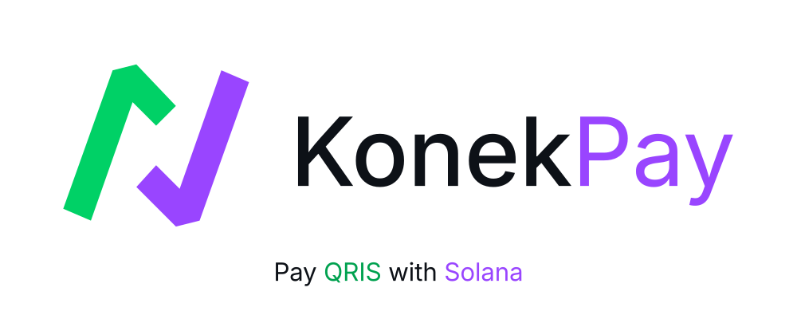

<p align="center">
  <picture>
    <source media="(prefers-color-scheme: dark)" srcset="misc/dark.svg">
    <source media="(prefers-color-scheme: light)" srcset="misc/light.svg">
    
  </picture>
</p>

<p align="center">
  <strong>Solana x QRIS payment bridge for Indonesia</strong>
</p>

<p align="center">
  <a href="https://konekpay.online"></a>
  
  
  
  
</p>

KonekPay lets people pay a QRIS merchant using a Solana wallet.

The prototype scans a standard Indonesian QRIS payload, extracts merchant and rupiah payment data, quotes the equivalent SOL amount, opens Phantom for a Solana devnet transfer, verifies the transaction on the backend, and presents a payment proof plus a simulated merchant payout record.

The goal is simple: make a Solana payment feel as familiar as scanning QRIS at a local cashier.

## Links

| Item | Link |
| --- | --- |
| Live demo | [konekpay.online](https://konekpay.online) |
| Repository | [github.com/justhenix/konek](https://github.com/justhenix/konek) |
| Hackathon | Colosseum Frontier Hackathon |
| Side Track | Superteam Indonesia National Campus Hackathon |

<!-- Add the final demo video URL here after recording. -->
<!-- Add the final pitch deck URL here after publishing. -->

## Why KonekPay

QRIS is the everyday payment surface in Indonesia. Crypto wallets are powerful, but they still feel detached from normal offline commerce. KonekPay explores a consumer bridge between those two worlds:

- Customers scan a familiar QRIS code.
- The app turns the rupiah amount into a SOL payment quote.
- Phantom handles the wallet payment.
- The backend verifies the Solana transaction.
- The merchant-facing rupiah payout is represented as a demo settlement record.

This is not a claim that QRIS settlement is live on Solana today. It is a hackathon prototype showing how a compliant production path could connect an on-chain payment to a licensed fiat off-ramp and payout rail.

## Demo Flow

1. Open [konekpay.online](https://konekpay.online).
2. Connect Phantom and use Solana devnet.
3. Click **Use Demo QRIS** or scan/paste a QRIS payload.
4. Review the merchant name, rupiah amount, and quoted SOL amount.
5. Confirm payment in Phantom.
6. The backend verifies the devnet transaction against the signed quote.
7. The app shows a payment proof and Solana Explorer link.
8. The app shows a simulated SOL-to-IDR off-ramp and merchant bank payout record.
9. The user can copy, share, or download the receipt.

## Real vs Simulated Scope

| Area | Current prototype behavior |
| --- | --- |
| QRIS payload | Parsed from camera, paste input, or synthetic Demo QRIS |
| SOL payment | Real Solana devnet transaction through Phantom |
| Price quote | Live SOL/IDR quote through backend pricing logic |
| Verification | Real backend verification against Solana devnet |
| Receipt | Real app-generated proof with transaction metadata |
| Merchant payout | Simulated demo record only |
| IDR disbursement | Not executed |
| Mainnet payment | Not executed |
| Licensed gateway integration | Planned production path |

Important boundaries:

- QRIS itself has no devnet.
- Demo QRIS is synthetic and does not represent a real merchant acquirer.
- No real rupiah is disbursed by this prototype.
- No real Indodax, Tokocrypto, Midtrans, Xendit, DOKU, bank API, or Solana mainnet flow is executed.
- KonekPay does not bypass Indonesian payment regulation. A production version would require licensed partners, merchant onboarding, KYC/KYB, compliance review, reconciliation, and production custody decisions.

## Architecture

```mermaid
flowchart LR
  U["User<br/>scans QRIS or uses Demo QRIS"] --> W["KonekPay Web App<br/>parse EMVCo, review payment"]
  W --> Q["Vercel Serverless API<br/>validate QRIS, price SOL/IDR, sign quote"]
  Q --> P["Phantom Wallet<br/>sign Solana devnet transfer"]
  P --> S["Solana Devnet<br/>confirmed transaction signature"]
  S --> V["Verification API<br/>check quote, wallet, amount, expiry, status"]
  V --> R["Receipt + Demo Settlement<br/>payment proof and simulated payout"]

  classDef user fill:#111827,stroke:#9945ff,color:#ffffff
  classDef app fill:#0d1117,stroke:#14f195,color:#ffffff
  classDef api fill:#0d1117,stroke:#9945ff,color:#ffffff
  classDef chain fill:#06130d,stroke:#14f195,color:#ffffff
  classDef receipt fill:#140f24,stroke:#9945ff,color:#ffffff

  class U user
  class W app
  class Q,V api
  class P,S chain
  class R receipt
```



## What Works Today

- Browser QRIS scanning with camera support.
- Built-in Demo QRIS flow for reliable live demos.
- EMVCo TLV QRIS parsing.
- Dynamic QRIS amount extraction from Tag `54`.
- Static QRIS manual rupiah amount fallback when Tag `54` is missing.
- Strict manual amount validation.
- Phantom desktop wallet flow.
- Phantom mobile deeplink and session recovery flow.
- Solana devnet transfer flow.
- Live SOL/IDR quote endpoint using Pyth Hermes plus fallback FX source.
- Backend quote signing.
- Server-side Solana devnet transaction verification.
- Payment proof UI with Explorer link.
- Shareable/downloadable receipt support.
- Demo merchant payout record UI.
- Transaction history UI and backend helpers.
- Supabase server-only helper modules for transaction persistence.
- Vercel serverless API deployment structure.
- Unit tests for QRIS parsing, quote logic, verification, settlement, history, transactions, and receipts.

## Tech Stack

| Layer | Tools |
| --- | --- |
| Frontend | Vite, React, Tailwind CSS |
| Wallet | Phantom, Solana Wallet Adapter |
| Blockchain | Solana devnet, `@solana/web3.js` |
| QR scanning | `html5-qrcode` |
| QR/receipt generation | `qrcode`, `qrcode.react`, `html-to-image` |
| Pricing | Pyth Hermes plus fallback FX source |
| Backend | Vercel Serverless Functions |
| Database helpers | Supabase Postgres server-only modules |
| Tests | Node test runner |

<details>
<summary><strong>Core API</strong></summary>

### `POST /api/v1/payment/quote`

Creates a short-lived signed SOL quote from a QRIS payload.

For dynamic QRIS, the backend uses Tag `54` from the QRIS payload. For static QRIS, the client may provide a manual `idrAmount`, but only when Tag `54` is missing.

```json
{
  "qrisPayload": "000201...",
  "idrAmount": "15000"
}
```

Validation highlights:

- `qrisPayload` is required.
- QRIS Tag `54` wins over client-provided `idrAmount`.
- Manual amount is allowed only for static QRIS without Tag `54`.
- Manual amount must be a strict whole IDR integer string.
- Rejected examples: `Rp 25.000`, `25,000`, `1e5`, `0`, `-1`, `15000abc`, `15000.50`.
- The endpoint returns a short-lived signed quote.

### `POST /api/v1/payment/verify`

Verifies a submitted Solana devnet transaction against the backend quote.

```json
{
  "quoteId": "demo_quote_v1....",
  "signature": "5zy..."
}
```

The verification path checks the signed quote, expiry, expected treasury wallet, expected lamports, and transaction status on Solana devnet.

### `POST /api/v1/payment/settle-demo`

Creates a simulated merchant settlement record for the hackathon demo.

```json
{
  "quoteId": "demo_quote_v1....",
  "signature": "5zy..."
}
```

This endpoint does not call a real exchange, payment gateway, bank API, or IDR payout provider.

### `GET /api/v1/payment/history`

Returns payment history data for the connected wallet flow.

</details>

<details>
<summary><strong>Project Structure</strong></summary>

```text
api/
  lib/
    settlement/
      mockOfframp.js      Demo-only SOL_DEVNET to IDR_SIMULATED adapter
      mockPayout.js       Demo-only merchant bank payout adapter
    paymentQuotes.js      Quote generation and HMAC signing
    supabaseAdmin.js      Server-only Supabase client
    transactions.js       Transaction database helpers
  v1/
    payment/
      quote.js            POST /api/v1/payment/quote
      verify.js           POST /api/v1/payment/verify
      settle-demo.js      POST /api/v1/payment/settle-demo
      history.js          GET /api/v1/payment/history

src/
  components/
    WalletContextProvider.jsx
  utils/
    demoQris.js           Synthetic demo QRIS payload generator
    parseEmvcoQris.js     EMVCo QRIS parser
    payment.js            Payment formatting helpers
    receipt.js            Receipt copy/share/download helpers
    receiptImage.js       Receipt image export helpers
    solanaPayment.js      Solana transaction helpers
  App.jsx                 Landing page and app shell
  QrisScanner.jsx         Camera scanner, demo QRIS, paste input
  PaymentPage.jsx         QRIS review, payment, verification, receipt, settlement UI
```

</details>

<details>
<summary><strong>Local Development</strong></summary>

### Prerequisites

- Node.js 20 or newer
- npm
- Phantom Wallet
- Optional: Vercel CLI for local serverless API testing

### Install

```bash
git clone https://github.com/justhenix/konek.git
cd konek
npm install
```

### Configure environment variables

```bash
cp .env.example .env.local
npm run dev:check-env
```

Required payment variables for the full demo flow:

```text
VITE_SOLANA_RPC_URL
SOLANA_RPC_URL
VITE_TREASURY_WALLET
TREASURY_WALLET
PAYMENT_QUOTE_SECRET
```

Optional/future variables:

```text
VITE_PUBLIC_SUPABASE_URL
VITE_PUBLIC_SUPABASE_ANON_KEY
SUPABASE_SERVICE_ROLE_KEY
MIDTRANS_SERVER_KEY
```

### Run locally

Frontend only:

```bash
npm run dev
```

Full-stack local development with Vercel serverless functions:

```bash
npm run dev:vercel
```

### Scripts

```bash
npm run dev            # Start the Vite development server
npm run dev:vercel     # Start Vercel dev with .env.local injected
npm run dev:check-env  # Validate required env vars in .env.local
npm run build          # Build the production frontend bundle
npm run preview        # Preview the production build locally
npm run lint           # Run ESLint
npm test               # Run backend and utility tests
```

</details>

## Deployment

The project is configured for Vercel.

| Setting | Value |
| --- | --- |
| Framework | Vite |
| Build command | `npm run build` |
| Output directory | `dist` |
| API routes | `api/**` |

After changing any `VITE_*` variable in Vercel, redeploy the project. Vite bakes public environment variables into the frontend bundle during build.

## Roadmap

### Hackathon prototype

- [x] QRIS scanner and Demo QRIS flow
- [x] Phantom desktop and mobile flow
- [x] Live SOL/IDR quote endpoint
- [x] Backend Solana devnet verification
- [x] Payment proof and receipt UI
- [x] Demo merchant payout record
- [x] Strict QRIS/manual amount validation
- [x] Transaction history flow
- [x] Unit tests for quote, verify, settlement, history, transactions, QRIS parser, and receipt utilities

### Next milestones

- [ ] Publish final demo video
- [ ] Publish final pitch deck
- [ ] Persist the full payment lifecycle from quote to verification to settlement record
- [ ] Add settlement reconciliation states
- [ ] Add E2E test for Demo QRIS to verified payment flow
- [ ] Improve merchant-facing payout dashboard and history

### Production path

- [ ] Complete business/legal onboarding for a QRIS-capable payment gateway
- [ ] Integrate a licensed crypto off-ramp or exchange partner
- [ ] Integrate a licensed payout/payment gateway partner
- [ ] Add settlement reconciliation and failure handling
- [ ] Add compliance, security review, and key-management hardening
- [ ] Decide mainnet treasury and custody model
- [ ] Add fee model and exchange-rate risk controls

## Built For

KonekPay was built for the Colosseum Frontier Hackathon and the Superteam Indonesia sidetrack as a focused prototype of local payment UX on Solana.

## Team

| Member | Role | Contribution |
| --- | --- | --- |
| [Henix](https://github.com/justhenix) | Lead developer, product lead | Led product direction and full-stack implementation across QRIS parsing, Solana payment flow, backend verification, receipt/history flow, and demo readiness. |
| [Akil](https://github.com/MuhAqielAdhiRajendra) | Frontend and UI contributor | Supported landing page polish, responsive interface work, demo experience, and frontend presentation details. |
| [Freshifa](https://github.com/seary05) | Business, pitch, and market research | Supported business framing, pitch deck preparation, market research, presentation materials, and review/QA. |

KonekPay was built as a focused hackathon prototype with Henix leading engineering and product execution, supported by Akil on frontend/UI and Freshifa on pitch/business work.

## Acknowledgements

- [Colosseum](https://colosseum.com/)
- [Superteam](https://superteam.fun/)
- [Solana](https://solana.com/)
- [Pyth Network](https://pyth.network/)
- [Bank Indonesia QRIS](https://www.bi.go.id/en/fungsi-utama/sistem-pembayaran/ritel/kanal-layanan/qris/default.aspx)
